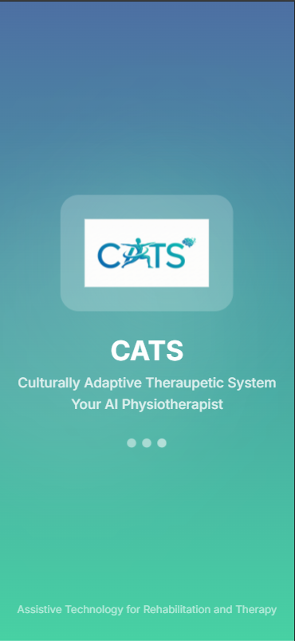
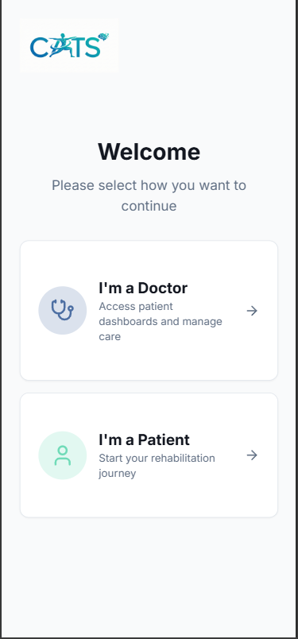
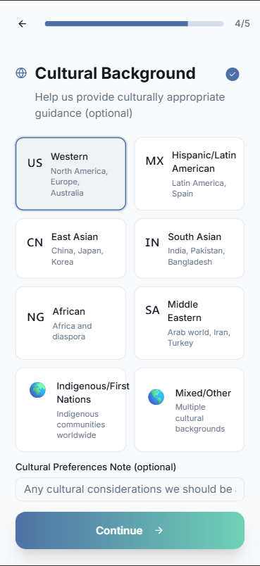
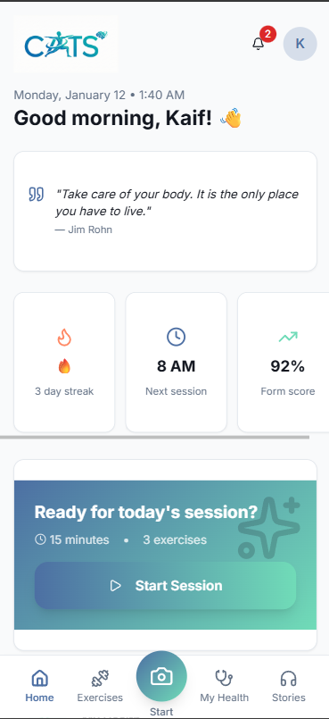
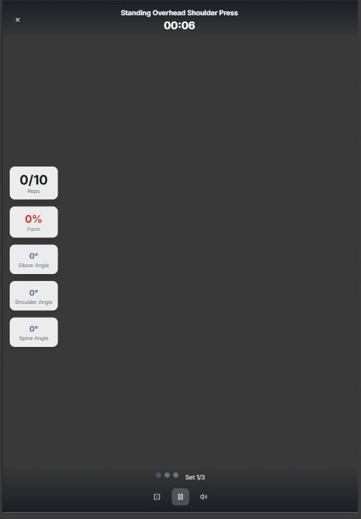
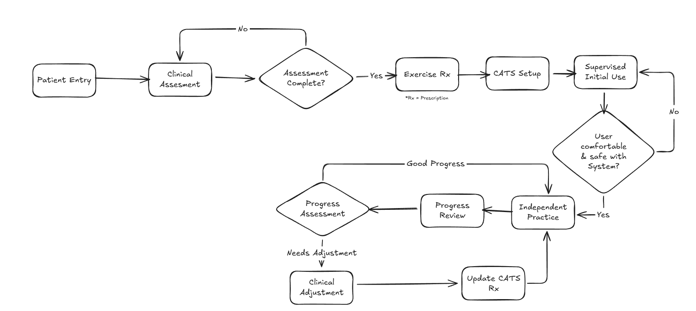

# Culturally Adaptive Therapeutic System (CATS)

## Overview

CATS is an assistive technology platform designed to support elderly individuals in therapeutic exercise routines. Operating under the principle of **assistive, not autonomous**, the system complements clinical care by providing culturally sensitive, real-time guidance while preserving the essential human connection in therapy.

## Core Philosophy

CATS functions as an assistive tool, not a replacement for clinical expertise:

- **Supports** therapeutic exercise execution with real-time guidance
- **Augments** clinical instruction with culturally appropriate demonstrations
- **Facilitates** independent practice between clinical sessions
- **Enhances** adherence through personalized, culturally resonant content
- **Never replaces** clinical assessment, diagnosis, or treatment planning

## Key Features

### Real-Time Exercise Assistance
- Camera-based posture analysis for form correction
- Age-appropriate exercise modifications (40-50, 50-60, 60-70, 70+ age groups)
- Safety monitoring with immediate feedback
- Exercise-specific angle calculations and form analysis

### Cultural Adaptation
- Multilingual support (English, Spanish, French, Hindi, Chinese, Japanese, Portuguese, German)
- Culturally appropriate demonstrations and terminology
- Respectful adaptations for diverse cultural contexts (Western, Hispanic, East-Asian, South-Asian)

### Elderly-Focused Design
- Simplified interface with large interaction elements
- Chair-based exercise options for safety
- Adjustable text sizes and high contrast modes
- Extended pacing for reduced mobility
- Vibration feedback for hearing-impaired users

## Technical Requirements

- Modern web browser with camera functionality
- Internet connectivity for initial setup
- Local storage capacity: 10MB minimum
- WebGL 2.0 support for pose detection processing

## Current Capabilities

- Individual exercise sessions with real-time feedback
- Basic progress tracking and session history
- Local data processing for privacy
- Culturally adapted exercise content library
- Real-time pose detection using MediaPipe

## User Interface

<table align="center" cellspacing="20" cellpadding="10">
  <tr align="center">
    <td><strong>Landing Page</strong></td>
    <td><strong>Login</strong></td>
    <td><strong>Dashboard</strong></td>
    <td><strong>Exercise Selection</strong></td>
  </tr>
  <tr align="center">
    <td></td>
    <td></td>
    <td></td>
    <td></td>
  </tr>

  <tr align="center">
    <td><strong>Home Screen</strong></td>
    <td><strong>Exercise Library</strong></td>
    <td><strong>Exercise Detail</strong></td>
    <td><strong>My Health (Rx)</strong></td>
  </tr>
  <tr align="center">
    <td></td>
    <td></td>
    <td></td>
    <td></td>
  </tr>

  <tr align="center">
    <td colspan="2"><strong>Real-time Session</strong></td>
  </tr>
  <tr align="center">
    <td colspan="2"></td>
  </tr>
</table>

## Planned Development

### Caregiver Support Features
- Consent-based remote monitoring of participation metrics
- Automated progress reports for clinical review
- Notification system for performance changes
- Secure communication tools
- Educational resources for family support
- Integration with health monitoring devices

### Research Initiatives
- Community center adaptation for group sessions
- Professional tools for instructor guidance
- Social integration features
- Clinical dashboard for therapist oversight
- Custom exercise prescription capabilities
- Standardized outcome measurement tools

## Safety Protocols

- Chair-assisted exercise options for balance concerns
- Clear safety prompts and fatigue monitoring
- Emergency cessation functionality
- Fall prevention measures
- Guidance for seeking professional medical assistance

## Implementation

### Integration Workflow

### Home-Based Use
- Minimal setup requirements
- Space-efficient exercise designs
- Privacy-respecting assistance
- No specialized equipment required

## Usage Context

**Important**: This system is an assistive tool to support therapeutic exercise routines under professional guidance. It does not replace clinical assessment, diagnosis, or treatment planning. Users should obtain medical clearance from healthcare providers before initiating any exercise program.

The platform enhances existing therapeutic relationships by providing consistent, culturally appropriate support between clinical sessions.

## Conclusion

CATS represents a carefully considered approach to supporting elderly individuals in maintaining physical function through culturally sensitive exercise assistance.

---
